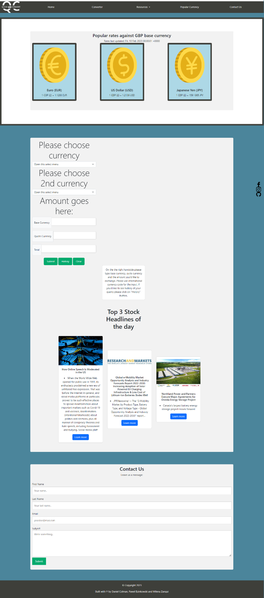

# Bootcamp Project 1

First Bootcamp (UK-VIRT-FE-PT-11-2022-U-LOLC-TWTH-2) project for Group 10:

- Pawel Bzinkowski
- Milena Tessari Zanqui
- Daniel Colman

The requirement of the project is to conceive and execute a website design that solves a real-world problem by integrating data received from multiple server-side API requests.

Our user story is for a UK-based traveller to have a resource to find the latest exchange rates, convert currencies and identify any stocks and shares news that may impact their finances.

We therefore identified 2 APIs (see Credits section) from which the user can request relevant data and have it presented on the page in a useful and clear way (see Usage section).git

The website has to meet the following requirements:
- Use Bootstrap.

- Be deployed to GitHub Pages.

- Be interactive (in other words, accept and respond to user input).

- Use at least two server-side APIs Links to an external site..

- Use modals instead of alerts, confirms, or prompts.

- Use client-side storage to store persistent data.

- Be responsive.

- Have a polished UI.

- Have a clean repository that meets quality coding standards (file structure, naming conventions, best practices for class/id naming conventions, indentation, quality comments, and so on).

- Have a quality README (including a unique name, description, technologies used, screenshot, and link to the deployed application).

## Installation

URL: https://github.com/Bziczek7/projectOneGroup10

## Usage

Page comprised of 5 main sections:

1. Navigation bar linking to main sections of the site.
2. A "Popular Currencies" section for UK travellers showing 3 exchange rates of 3 common currencies against a base GBP rate - this pulls from an API which refreshes daily.
3. A "Currency Conversion" section which allows users to input a base currency, an amount and will return the amount of currency they wish to convert to.  This uses an event listener and an API.
4. A news section for top news stories which fetches the top 3 financial news stories from an API.
5. A "contact us" form.

See screenshot below:

## Credits

Collaborators:

- Pawel Bzinkowski (https://github.com/Bziczek7)
- Milena Tessari Zanqui (https://github.com/mitessari)
- Daniel Colman (https://github.com/42-djc)

APIs:

- https://www.exchangerate-api.com/
- https://www.marketaux.com/

## Licenses

n/a

## Badges

n/a

## Features

see Usage

## How to contribute

n/a